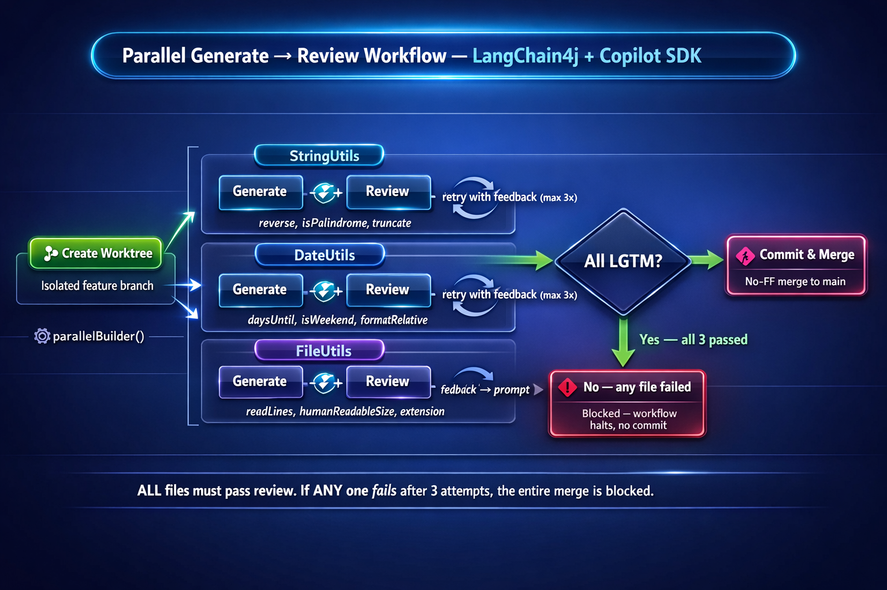

# Introducing the Copilot SDK for Java

Ever wanted to call GitHub Copilot from your Java code? Now you can.

The **[Copilot SDK for Java](https://github.com/github/copilot-sdk-java)** is the official GitHub SDK that gives you programmatic access to GitHub Copilot via the **GitHub Copilot CLI**, so you can build AI-powered tools, assistants, and agentic workflows—entirely in Java.

At a high level, your Java app talks to this SDK, and the SDK drives the Copilot CLI for you. That means you can embed Copilot-style experiences inside your own tools while staying close to the official Copilot ecosystem.

## How it works


*This diagram shows the end-to-end request flow from your Java code through the SDK, CLI, and GitHub API to the cloud LLM.*

When you call the SDK, your prompts are processed on **GitHub's servers**, not locally:

```
Your Java code → Copilot SDK → Copilot CLI → GitHub API → LLM (cloud)
```

1. **SDK** spawns/communicates with the Copilot CLI via JSON-RPC
2. **Copilot CLI** sends HTTPS requests to GitHub's API (authenticated with your GitHub token)
3. **GitHub's backend** routes to their LLM infrastructure (Azure OpenAI, Anthropic, etc.)
4. **Response streams back** through the same chain

No local inference occurs—all AI processing is server-side, metered against your Copilot subscription.

## Quick start

### Prerequisites


*This diagram shows the four setup steps needed before writing your first Copilot SDK call.*

Before you write a line of code, make sure your machine is ready.

You’ll need **Java 21+**, plus the **GitHub Copilot CLI** installed and accessible on your `PATH` (or you can point the SDK at it using a custom `cliPath`). You’ll also need an active Copilot entitlement, because the CLI won’t run without one.

#### Step 1: Install Node.js

The Copilot CLI is distributed via npm, so you'll need **Node.js 22+** installed.

- **Windows:** Download and install from [nodejs.org](https://nodejs.org/) or use `winget install OpenJS.NodeJS`
- **macOS:** Use Homebrew: `brew install node`
- **Linux:** Use your package manager or [NodeSource](https://github.com/nodesource/distributions)

Verify Node.js is installed:

```bash
node --version
# Should output v22.x.x or higher
```

#### Step 2: Install the Copilot CLI

Install or upgrade the Copilot CLI globally via npm:

```bash
npm install -g @github/copilot
# or to upgrade
npm update -g @github/copilot
```

Verify:

```bash
copilot --version
```

#### Step 3: Authenticate with GitHub

On first use, the Copilot CLI will prompt you to authenticate. Run any Copilot command to trigger the login flow:

```bash
copilot --help
```

If you're not authenticated, it will open a browser window for GitHub OAuth. Complete the authentication, and you're ready to go.

> **Tip:** If you're behind a corporate proxy or firewall, ensure `copilot` can reach GitHub's APIs. You may need to configure `HTTP_PROXY` or `HTTPS_PROXY` environment variables.

### Dev Container / GitHub Codespaces

This repo includes a [Dev Container](.devcontainer/devcontainer.json) configuration that sets up everything you need automatically:

- **Java 21** (via `mcr.microsoft.com/devcontainers/java:21-bookworm`)
- **GitHub CLI** (`gh`) with the **Copilot CLI extension** (`gh-copilot`)
- **Maven dependencies** pre-resolved on container creation
- **VS Code extensions**: Java Extension Pack, Spring Boot Tools, GitHub Copilot

To get started:

1. **Open in a Codespace** — click the green "Code" button on GitHub and select "Open with Codespaces", or
2. **Open locally in VS Code** — with the [Dev Containers extension](https://marketplace.visualstudio.com/items?itemName=ms-vscode-remote.remote-containers) installed, open this repo and choose "Reopen in Container"

Once the container is running, authenticate with the GitHub CLI:

```bash
gh auth login
```

Then install the Copilot CLI extension (if it wasn't auto-installed during container creation):

```bash
gh extension install github/gh-copilot
```

### Add the dependency

If you’re using Maven:

```xml
<dependency>
  <groupId>com.github</groupId>
  <artifactId>copilot-sdk-java</artifactId>
  <version>0.1.32-java.0</version>
</dependency>
```

Or Gradle:

```groovy
implementation 'com.github:copilot-sdk-java:0.1.32-java.0'
```

### Your first “Copilot from Java” call

This example starts a client, opens a session, streams assistant messages via events, and exits once the session goes idle.

```java
package com.example.copilot;

import com.github.copilot.sdk.*;
import com.github.copilot.sdk.events.*;
import com.github.copilot.sdk.json.*;
import java.util.concurrent.CompletableFuture;

public class Example {
  public static void main(String[] args) throws Exception {
    try (var client = new CopilotClient()) {
      client.start().get();

      var session = client.createSession(
        new SessionConfig()
          .setModel("claude-sonnet-4.5")
          .setOnPermissionRequest(PermissionHandler.APPROVE_ALL)
      ).get();

      var done = new CompletableFuture<Void>();
      session.on(evt -> {
        if (evt instanceof AssistantMessageEvent msg) {
          System.out.println(msg.getData().content());
        } else if (evt instanceof SessionIdleEvent) {
          done.complete(null);
        }
      });

      session.send(new MessageOptions().setPrompt("What is 2+2?")).get();
      done.get();
    }
  }
}
```

> **Note:** The `PermissionHandler.APPROVE_ALL` handler is required when creating a session. It grants all permission requests from the SDK. For production use, consider implementing a custom handler that selectively approves permissions.

Run it:

```bash
mvn compile exec:java
```

Or, if you prefer using the Maven wrapper (which doesn't require Maven to be installed globally):

```bash
# Add the wrapper to your project (one-time setup)
mvn wrapper:wrapper

# Run with the wrapper
./mvnw compile exec:java
```

And you should see output like:

```text
2+2 equals 4.
```

That’s it—you just called Copilot from Java.
## Advanced Example


*This diagram shows the five advanced capabilities available through the SDK.*

For more complex scenarios, check out [`AdvancedExample.java`](src/main/java/com/example/copilot/AdvancedExample.java) which demonstrates:

- **System Messages** – Customize AI behavior with `SystemMessageConfig`
- **Code Review** – Submit code for AI analysis of thread safety, null safety, and best practices
- **Multi-turn Conversations** – Context-aware conversations where each prompt builds on previous responses
- **Structured JSON Output** – Request responses in specific JSON formats for parsing
- **Code Generation** – Generate production-ready Java code with specific requirements

Run it:

```bash
mvn compile exec:java -Dexec.mainClass=com.example.copilot.AdvancedExample
```
## Worktree Auto-Merge Workflow


*This diagram shows the six-step automated workflow: create a worktree, generate code, review it, and merge — all driven by the Copilot SDK.*

[`WorktreeAutoMergeExample.java`](src/main/java/com/example/copilot/WorktreeAutoMergeExample.java) demonstrates a fully automated Git workflow powered by the Copilot SDK:

1. **Create Worktree** – Spins up a Git worktree on a new feature branch, isolating changes from `main`
2. **Generate Code** – Uses the Copilot SDK to generate a `StringUtils` utility class with `reverse`, `isPalindrome`, and `truncate` methods
3. **Write to Worktree** – Saves the generated source into the isolated worktree (stripping any markdown fences)
4. **AI Code Review** – Opens a second Copilot session to review the generated code for correctness, null safety, and edge cases
5. **Commit Changes** – Stages and commits the new file in the worktree
6. **Merge to Main** – Performs a no-fast-forward merge back into `main`, then cleans up the worktree and branch

The workflow is **idempotent** — it can be run repeatedly without manual cleanup. Previous artifacts are automatically removed before each run.

**Why a worktree?** A Git worktree gives the feature branch its own directory, so code generation and commits happen in isolation without disturbing your working directory on `main` — no stashing, no checkout switching. If you have the main repo open in VS Code, your workspace stays completely undisturbed until the final merge atomically brings the new file in — already committed, with a clean working tree.

| Step | What happens | VS Code sees changes? |
|---|---|---|
| 1–3 | Create worktree, generate code, write file | **No** — work happens in a separate directory |
| 4–5 | AI code review, commit in worktree | **No** — still isolated from main |
| 6 | Merge feature branch into main | **Yes** — file appears in the explorer, already committed |

> **Note:** All Git operations are **local only** — no `git push` or remote calls are made. Your remote repository is never modified.

Run it:

```bash
mvn compile exec:java -Dexec.mainClass=com.example.copilot.WorktreeAutoMergeExample
```
## Parallel Worktree Workflow (LangChain4j Agentic)



*This diagram shows the fan-out pipeline: 3 parallel lanes each run a generate→review loop with retry, gated by code review before proceeding to commit.*

[`ParallelWorktreeExample.java`](src/main/java/com/example/copilot/ParallelWorktreeExample.java) extends the worktree pattern with **parallel fan-out** using [LangChain4j's agentic module](https://github.com/langchain4j/langchain4j) (`AgenticServices.parallelBuilder()`), inspired by LangChain4j's [loop workflow pattern](https://docs.langchain4j.dev/tutorials/agents/):

```
                          ╭→ Lane A: generate StringUtils → review → retry if FAIL ─╮
Create worktree ──────────├→ Lane B: generate DateUtils  → review → retry if FAIL  ─├→ Commit → Merge
  (sequential setup)      ╰→ Lane C: generate FileUtils  → review → retry if FAIL  ─╯
                                     (parallel fan-out, each lane loops up to 3×)
```

Each lane wraps a Copilot SDK session and runs its own **generate→review loop**:

1. **Generate** — Copilot produces the utility class with explicit requirements for null safety, edge cases, and Unicode handling
2. **Review** — A second Copilot session reviews the code, responding with `LGTM` (pass) or `FAIL` (with issues)
3. **Retry with feedback** — If the review fails, the reviewer's feedback is appended to the generation prompt and the code is regenerated (up to 3 attempts)
4. **Gate** — If all 3 attempts fail, the workflow throws and blocks the commit — no bad code gets merged

This is analogous to LangChain4j's loop workflow where a scorer agent evaluates output quality and the loop continues until a threshold is met. Here, the "scorer" is the Copilot code reviewer and the threshold is `LGTM`.

### What happens when a review fails?

The review gate is strict — if a file can't pass review, it blocks the entire workflow:

| Attempt | What happens |
|---|---|
| **1st fail** | Reviewer's feedback is captured and appended to the generation prompt: *"Fix ALL of these issues: [feedback]"*. Code is regenerated. |
| **2nd fail** | Same process — latest feedback replaces the previous, code is regenerated again. |
| **3rd fail** | The lane throws `RuntimeException`, which propagates through `parallelBuilder()` and **blocks the commit and merge steps entirely**. |

This means:
- **No file can sneak past a failed review** — every generated class must get `LGTM` before the workflow proceeds
- **A single failed file blocks all files** — even if the other two lanes passed, the commit won't happen
- **Cleanup always runs** — the `finally` block removes the worktree and branch regardless of success or failure

The feedback loop is the key to reliability: rather than just retrying blindly, the reviewer's specific issues (e.g., "missing null check", "surrogate pair bug in `truncate()`") are fed directly into the next generation prompt, so Copilot can fix exactly what was flagged.

Run it:

```bash
mvn compile exec:java -Dexec.mainClass=com.example.copilot.ParallelWorktreeExample
```

> Requires `langchain4j-agentic` (v1.12.2) — already included in the project's BOM.
## Prefer “zero project setup”? Use JBang

If you don’t want to create a Maven or Gradle project just to try the SDK, you can run the repo’s example using [JBang](https://www.jbang.dev/). It’s the fastest “kick the tires” option when you’re experimenting or demoing.

```bash
jbang jbang_example.java
```

JBang handles dependencies automatically, so you can go from copy/paste to running in a single command.

## What can you build?


*This diagram shows the types of tools and workflows you can build with the Copilot SDK.*

If you can describe it as “Copilot, but inside my product,” it’s a good fit.

You can build internal coding assistants that understand your team’s conventions, automated PR reviewers that summarize changes and suggest improvements, test generators that align with your project patterns, documentation bots that stay in sync with the codebase, or agent-style workflows that can reason, plan, and execute across tools you define.

## Learn more

- **Official SDK repository:** https://github.com/github/copilot-sdk-java


